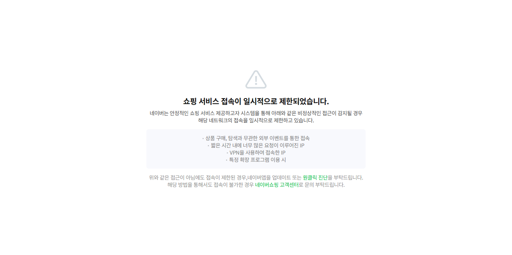

# Naver_Store_Scraping
Naver Shopping Scraping은 네이버 스토어에서 상품 정보를 자동으로 수집하는 웹 스크래핑 도구입니다.</br>
사용자가 원하는 만큼의 데이터를 수집하여 CSV 파일로 저장하며, 실시간으로 스크래핑 과정을 확인할 수 있습니다.</br>
제품명, 가격, 평점, 리뷰 개수 등의 핵심 정보를 효율적으로 수집하여 데이터 분석 및 가격 비교에 활용할 수 있습니다.</br>
브라우저 창을 통해 스크롤 과정을 시각적으로 확인하면서 터미널에서는 실시간으로 수집된 상품 정보를 상세히 볼 수 있습니다.

## ⚠️ 주의사항
   - 개인적인 데이터 수집 목적으로만 사용을 권장합니다.
   - 이 프로젝트는 데이터 수집 및 분석을 위한 교육 목적으로 개발되었습니다.
---

## 🏗️ 기술 스택

- **Python**
- **Selenium**
- **Pandas**

---

📋 수집 데이터

- 제품명: 상품의 전체 이름
- 가격: 할인된 판매 가격
- 평점: 별점 
- 리뷰개수: 구매후기 개수

📁 결과 파일

- N번 스크롤 결과: 입력한 파일이름_{스크롤 횟수}_scrolls_{현재날짜_시간}.csv</br>
- 최대 스크롤 결과: 입력한 파일이름_max_scroll_{현재날짜_시간}.csv
   
---

🔍 주요 기여

- 🖥️ 시각적 스크래핑: 브라우저 창에서 스크롤 과정 실시간 확인
- 📊 실시간 데이터 출력: 터미널에서 수집된 상품 정보 즉시 표시
- 🔄 다양한 수집 모드: 단일 페이지, 커스텀 스크롤, 최대 스크롤 옵션
- 💾 CSV 자동 저장: 수집된 데이터를 구조화된 형태로 저장
- 📈 통계 정보 제공: 평균 가격, 평점 등 분석 정보 자동 계산


## 사용 방법

1. 이 저장소를 클론 또는 파일을 저장합니다.
   ```bash
   https://github.com/KBohyeon/scraping.git
   ```

2. 필요한 라이브러리를 설치합니다.
   ```bash
   pip install selenium
   pip install pandas
   ```

3. Chrome WebDriver 설치
   Chrome 브라우저 버전에 맞는 ChromeDriver 다운로드</br>
   PATH에 추가하거나 프로젝트 폴더에 배치

4. 실행
   ```bash
   python Naver_Store_Scraping.py
   ```

(※ 스크래핑 작동 영상)](https://www.youtube.com/watch?v=NptaBqn4LEI)

---
   
## 결과 

<table>
  <tr>
    <td align="center"><b>csv 파일</b></td>
  </tr>
    <tr>
    <td></td>
  </tr>
</table>

---

## 실행
- 실행시 이런 문구가 나옵니다.

1. 커스텀 스크롤 스크래핑
2. 최대 스크롤 스크래핑 (모든 상품)

  1번은 스크래핑할 스크롤 횟수를 지정 할 수 있습니다.</br>
  2번은 스코롤이 더이상 내려가지 않을 때까지 스크래핑을 진행합니다.</br>
  주의 - 오랜 시간이 걸릴 수 있습니다.

- 번호 선택시 나오는 문구
  
스크롤 횟수를 입력 후 엔터를 누르세요 (예: 10): -> 스크롤 횟수를 지정합니다.</br>
스크래핑할 URL을 입력 후 엔터를 누르세요 -> 네이버 스토어에서 스크래핑할 제품을 검색 후 검색된 페이지의 URL을 입력합니다.(이유 아래서 설명)</br>
저장할 CSV 파일 이름을 입력 후 엔터를 누르세요.(예: 감자, 노트북, 갤럭시 북) 최종 파일이름은 (입력한 파일이름_스크롤 횟수_현재날짜_시간.csv)로 저장됩니다.: </br>

---

## 왜 검색까지 지원하지 않는가

처음 검색 자동화시 쇼핑 서비스 접속이 제한되어 사람이 직접 입력하는것 처럼 보이기 위해 한 글자씩 랜덤한 시간을 두어 입력 되도록 개발을 하였으나 계속 실패하였습니다.
해결 방안으로 검색된 URL을 직접 넣는 방법을 사용하게 되었습니다.

<table>
  <tr>
    <td align="center"><b>검색 자동시 일시정지</b></td>
  </tr>
    <tr>
    <td></td>
  </tr>
</table>
 
---

## 기타 설명

- html 추출명
  
   제품명: productCardTitle_product_card_title__eQupA</br>
   가격: priceTag_number__1QW0R</br>
   평점: productCardReview_star__7iHNO</br>
   리뷰개수: productCardReview_text__A9N9N

## 📌 향후 개선 방향

- 검색 자동화

---

## 📮 문의

- 이메일: `qhgus9346@gmail.com`
